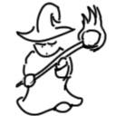

# dots

Golang package that converts images to be represented with braille unicode
characters.

This style works best with line art images, since unlike other ascii art
styles, braille doesn't support any kind of shading or gradient. A braille dot
is either there to represent a pixel, or it isn't.

Color support may be added in the future.

## Example



Becomes
```
⠀⠀⠀⠀⠀⠀⠀⠀⠀⠀⠀⠀⠀⠀⢀⣤⣶⣶⣤⣀⠀⠀⠀⠀⠀⠀⠀⠀⠀⠀⠀⠀⣀⠀⠀⠀⠀⠀
⠀⠀⠀⠀⠀⠀⠀⠀⠀⠀⠀⠀⠀⢠⣿⠋⠀⠀⠈⢻⣧⠀⠀⠀⠀⠀⠀⠀⠀⠈⣿⣦⣿⣿⡆⠀⠀⠀
⠀⠀⠀⠀⠀⠀⠀⠀⠀⠀⠀⠀⢀⣿⠃⠀⠀⣾⣇⠈⣿⠀⠀⠀⠀⠀⠀⠐⣶⣆⢸⡟⣿⡿⣿⡀⠀⠀
⠀⠀⠀⠀⠀⠀⠀⠀⠀⠀⠀⠀⢸⡟⠀⠀⠀⣿⡿⣦⣿⡀⠀⠀⠀⠀⠀⠀⣾⣿⣿⠇⢹⡇⣿⡇⠀⠀
⠀⠀⠀⠀⠀⠀⠀⠀⠀⠀⠀⣴⢾⡇⠀⠀⠀⠘⢿⣬⣭⣶⣶⣤⣄⣀⡀⠀⣹⡏⠉⠀⠛⠃⢹⣧⠀⠀
⠀⠀⠀⠀⠀⢰⣶⣤⣤⣴⡾⠋⠸⠷⠀⠀⠀⠀⠀⠉⣁⣠⣴⡾⠿⠛⢡⣾⣿⡶⠿⠛⠻⢷⣦⢻⣧⠀
⠀⠀⠀⠀⠀⠀⠙⠻⣷⣤⣄⣀⣀⣀⣀⣠⣤⣶⡾⠟⠛⠉⠁⠀⠀⠀⢸⣿⣿⠀⠀⠀⠀⢰⣿⢸⣿⠀
⠀⠀⠀⠀⠀⠀⠀⠀⠀⠉⠉⣿⡿⣿⣿⣿⢿⣶⡾⠟⠀⠀⠀⠀⢀⣠⣴⠿⣿⣧⣤⣤⣴⣿⢃⣾⠏⠀
⠀⠀⠀⠀⠀⠀⠀⠀⠀⠀⣠⣼⣷⡀⠉⠀⠀⠈⠁⣰⡿⢷⣤⡾⢟⣯⣶⠟⠛⠛⠻⣿⣿⡿⠟⠁⠀⠀
⠀⠀⠀⠀⠀⠀⠀⠀⢀⣼⠟⠉⠙⠿⣶⣼⣷⣶⠿⣫⣾⣟⣭⣾⣟⠉⠀⠀⠀⠀⠀⠀⠁⠀⠀⠀⠀⠀
⠀⠀⠀⠀⠀⠀⠀⠀⢸⡏⠀⠀⠀⠀⠀⠀⢀⣤⣾⣫⣿⠋⢻⡞⣿⡀⠀⠀⠀⠀⠀⠀⠀⠀⠀⠀⠀⠀
⠀⠀⠀⠀⠀⠀⠀⢰⣿⠁⠀⠀⠀⠀⢀⣴⣿⣿⢿⣿⣯⣴⠿⣿⣿⡇⠀⠀⠀⠀⠀⠀⠀⠀⠀⠀⠀⠀
⠀⠀⠀⠀⠀⠀⠀⠸⣿⣠⣤⣤⣤⣾⣿⡿⠛⠁⢸⣿⠋⠁⢰⣿⣿⠃⠀⠀⠀⠀⠀⠀⠀⠀⠀⠀⠀⠀
⠀⠀⠀⠀⠀⠀⠀⣠⣿⠋⠉⣿⣿⠟⠉⠀⠀⠀⠀⠙⠿⢿⣿⣿⠟⠀⠀⠀⠀⠀⠀⠀⠀⠀⠀⠀⠀⠀
⠀⠀⠀⠀⠀⣴⣾⡿⣿⣤⣿⡿⠃⠀⠀⠀⠀⠀⠀⠀⠀⠀⣿⡇⠀⠀⠀⠀⠀⠀⠀⠀⠀⠀⠀⠀⠀⠀
⠀⠀⠀⠀⠀⠉⠁⠀⠈⣿⠏⠀⠀⠀⠀⠀⠀⠀⠀⠀⠀⠐⠿⣧⡀⠀⠀⠀⠀⠀⠀⠀⠀⠀⠀⠀⠀⠀
⠀⠀⠀⠀⠀⠀⣠⣤⣼⡟⠀⠀⠀⠀⠀⠀⠀⠀⠀⠀⠀⠀⠀⠘⠻⣶⣤⣄⡀⠀⠀⠀⠀⠀⠀⠀⠀⠀
⠀⠀⠀⠀⠀⢸⣟⠹⠏⠀⠀⠀⠀⠀⠀⠀⠀⠀⠀⢀⣤⣴⣦⣤⣀⡀⢈⣹⡿⠀⠀⠀⠀⠀⠀⠀⠀⠀
⠀⠀⠀⠀⠀⠈⠻⣦⡀⠀⠀⠀⠀⠀⠀⠀⣀⣤⣴⣿⡋⠀⢀⣹⡿⠛⠛⠋⠁⠀⠀⠀⠀⠀⠀⠀⠀⠀
⠀⠀⠀⠀⠀⠀⠀⠉⠻⢷⣦⣤⣤⣶⡾⠟⠛⠉⠉⠙⠛⠛⠛⠋⠁⠀⠀⠀⠀⠀⠀⠀⠀⠀⠀⠀⠀⠀
```
Image courtesy of https://opengameart.org/users/gfx0
